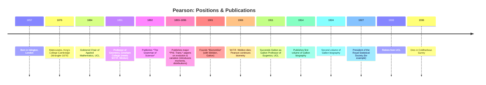

title: "Founder of statistical genomics Karl Pearson (1857–1936)"
layout: page
math: mathjax
date: 2026-09-26
entities:
  people:
    - karl-pearson

{{ page.date | date: "%Y-%m-%d" }}

**TLDR:** Karl Pearson was born in London into a well-off Quaker professional family (father a barrister; mother from merchant background) and was educated at University College School and King’s College, Cambridge (Third Wrangler, 1879).  After studies in Germany (physics, philosophy, languages), he became a leading Victorian polymath.  In 1884 he took the Goldsmid Chair of Applied Mathematics at UCL; he founded the journal *Biometrika* in 1901 (with W. F. R. Weldon and Francis Galton); and on Galton’s death (1911) became the first Galton Professor of Eugenics (later Genetics) at UCL.  Pearson’s most influential work was developing mathematical statistics (correlation, regression, probability distributions, chi-squared test) to analyse biological variation (“biometry”).  He introduced the **product-moment correlation coefficient** (building on Galton) and the method of moments, and his 1900 *Pearson’s chi-squared test* became a standard test of fit.  He founded statistical societies and departments (his UCL Statistics Department was the first in the world) and was appointed FRS in 1896.  Pearson’s extensive collaborations (with Weldon in evolutionary studies, with Galton in eugenics) and his students (including his son Egon Pearson) helped diffuse his methods.  Even today, “Pearson’s” correlation, regression, chi-square, moment and distribution families remain fundamental tools in genetic epidemiology and evidence assessment.  

Pearson was born in 1857 in Islington, London, to William Pearson (a self-made barrister) and Fanny Smith (daughter of a shipowner).  He was raised in a comfortable professional household (a “respectable” Victorian upbringing) and educated at University College School in London.  He went to King’s College, Cambridge in 1876 to read mathematics, graduating as Third Wrangler in 1879.  A gifted linguist and philosopher, Pearson then studied in Heidelberg and Berlin (1879–1880), where he attended lectures on physics, Darwinism (by Emil du Bois-Reymond), Roman law and philosophy.  He developed wide intellectual interests (history, literature, socialism) in the 1880s, founding a social club (“Men and Women’s Club”) and writing on German politics and literature.  Initially, he pursued law (called to the bar, 1881) but also gave popular lectures in science and social topics.  His early environment (Quaker-influenced, well-traveled) gave him a socially progressive and broadly scientific outlook.  Pearson married Maria Sharpe in 1890; they had two daughters (one of whom, Helga, compiled his papers) and a son, **Egon Pearson**, later a statistician.

Pearson’s professional career was largely at University College London.  In 1884 he was appointed Goldsmid Professor of Applied Mathematics and Mechanics at UCL, where he began applying mathematics to biology.  In 1891 he became Professor of Geometry at Gresham College (London), where he met zoologist W. F. R. Weldon; their collaboration on evolutionary data (crustacean variation) proved seminal.  Together they quantified selection and variation using statistical models (see Weldon & Pearson 1893–1906).  In 1896 Pearson was elected Fellow of the Royal Society for his theoretical work.  His major institutional achievement was founding *Biometrika* in 1901 (with Weldon and Galton), the first journal devoted to the mathematical analysis of biology.  After Weldon’s death (1906) and Galton’s death (1911), Pearson consolidated their legacies: he became Galton Professor of Eugenics at UCL in 1911 (using Galton’s bequest) and merged the Biometric and Galton laboratories into the new Department of Applied Statistics.  He led that department until retirement in 1933, making it “England’s premier source of statistical tuition”.  Along the way he held key positions (e.g. President of the Royal Statistical Society, President of the Eugenics Education Society) and received honors (Copley Medal, Darwin Medal).  

Pearson’s key publications were foundational for statistics and biometry.  In the 1890s he published a series of memoirs in *Philosophical Transactions* on the “mathematical theory of evolution” (e.g. 1893–1895), introducing the method of moments and classifying continuous distributions (“Pearson system” of curves).  He wrote *The Grammar of Science* (1892), a popular treatise arguing for a probabilistic view of scientific knowledge.  His classic 1896–1900 papers developed *correlation* and *regression*: for example, in 1888 Galton had introduced regression to the mean, and Pearson refined Galton’s ideas by formally defining the Pearson product-moment correlation.  In 1900 he introduced the **chi-squared test** for goodness-of-fit, linking observed frequencies to theoretical expectations.  Other notable works include a joint study of vision inheritance (1909) and essays on “Nature and Nurture” (1910).  He also undertook a three-volume biography of Galton (1914, 1924, 1930), demonstrating his devotion to Galton’s legacy.  A table of his major works is below.

Pearson’s collaborators and rivals shaped his science.  His partnership with Weldon (zoologist) lasted until Weldon’s death; together they quantified selection and argued for “biometry” in evolution.  Pearson’s mentor was Francis Galton, and after Galton’s death Pearson became executor of Galton’s estate and ideas (championing eugenics).  His academic circle included geneticists and statisticians: he famously debated **William Bateson** over Mendelism (Bateson’s critique of biometry was addressed statistically by Pearson’s team).  Pearson’s own son **Egon Pearson** (jointly with Jerzy Neyman) later developed modern significance testing, extending Karl’s ideas.  Through *Biometrika* and UCL he influenced many students (e.g. W.E. Johnson, I.J. Good).  Pearson’s prestige was such that Jacob Bronowski later called him “the founder of modern statistics”.  

Methodologically, Pearson’s legacy endures in statistical genomics.  The **Pearson correlation and linear regression** he formalized remain standard measures of association (e.g. in expression QTL studies).  His **chi-square test** underlies genetic association tests for contingency tables, and his emphasis on *moments* and distribution fitting underpins methods for modeling allele frequency spectra.  The “Pearson system” of curves, though eclipsed by modern parametric models, reflects the need to flexibly model biological data.  His insistence on rigorous probability models anticipated modern Bayesian and likelihood frameworks (even though Fisher later disputed his philosophy of significance).  Many of Pearson’s concepts – sampling distributions, moments, goodness-of-fit, regression – are so fundamental that they appear in today’s variant interpretation pipelines (for example, calculating expected genotype frequencies under Hardy–Weinberg equilibrium uses the chi-square).  He also helped institutionalize statistical science: the structure of UCL’s Biometry/Galton labs presaged today’s genomic centers that combine data, biostatistics, and genetics.

**Major works (Pearson, selected):**

| Title                                      | Year | Venue/Publisher           | Significance                                                  |
|--------------------------------------------|:----:|---------------------------|---------------------------------------------------------------|
| *The Grammar of Science*                   | 1892 | A. & C. Black (London)    | Popularizing probabilistic philosophy of science; influenced statisticians’ worldview.  |
| *On the Skew Variation Curve*              | 1895 | Phil. Trans. R. Soc. A    | Introduced “Pearson distributions” (system of continuous curves fit to data).  |
| *On a Generalised Theory of “Skew” Variation* | 1901 | Biometrika                | Extended distribution theory; foundational work in statistical theory.  |
| *On the Criterion χ² and the Calculation of Probability* | 1900 | Phil. Trans. R. Soc. A | Introduced the chi-squared goodness-of-fit test (Pearson’s χ²) for categorical data. |
| *Biometrika (founded)*                     | 1901 | Journal (with Galton, Weldon) | World’s first journal of mathematical biology, establishing statistics as a discipline. |
| *National Life from the Point of View of Science* | 1901 | Scholar’s Lectures (Macmillan) | Outlined his eugenic and social views; influential in early 20thC scientific community. |

**Sources:** This account draws on historical studies of Pearson and Fisher, including Norton’s social-history analysis, biographical dictionaries, and their own publications.  (Original works cited are available in archives such as the UCL Galton Lab and the University of Adelaide [Fisher’s papers], as well as classic journals *Biometrika* and *Philosophical Transactions*.) 

