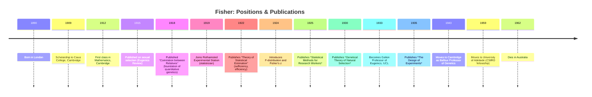

title: "Founder of statistical genomics Ronald A. Fisher (1890–1962)"
layout: page
math: mathjax
date: 2026-09-26
entities:
  people:
    - ronald-fisher

{{ page.date | date: "%Y-%m-%d" }}

**TLDR:** Ronald A. Fisher emerged from a comfortable London background (father a successful fine-arts auctioneer) and was educated at Harrow School and Gonville & Caius College, Cambridge (First in Mathematics, 1912).  Although he was initially expected to enter the Civil Service or clergy, Fisher turned to scientific questions.  During and after World War I he began to reconcile Gregor Mendel’s genetics with Darwinian evolution by applying rigorous statistical models, laying the foundations of *population genetics* and *biometrical genetics*.  Fisher’s major positions included Statistician at Rothamsted Experimental Station (1919–1933), Galton Professor of Eugenics at UCL (1933–1943), and Professor of Genetics at Cambridge (1943–1957), before retiring to Australia (Adelaide, 1957–1962).  His reputation rests on pioneering statistical methods (ANOVA, maximum likelihood, null hypothesis testing, design of experiments) and on integrating them with evolutionary genetics (e.g. *Genetical Theory of Natural Selection*, 1930).  He had influential patrons and collaborators (Leonard Darwin, J. B. S. Haldane, Sewall Wright) and was a contemporary of Karl Pearson (later a rival on inference).  Fisher’s methods – from the *p*-value and F-test to the additive polygenic model – remain cornerstones of modern statistical genomics and causal inference.  

Fisher was born to George Fisher and Kate Dodd in London in 1890.  He grew up in a middle-class household (his father was partner in an auctioneering firm), one of a set of twins (the other stillborn) with three sisters and one brother.  After his mother’s death (1904) and the family’s loss of fortune, Fisher excelled at Harrow School (winning a mathematics medal) and won a scholarship to Cambridge in 1909.  He took a First in Mathematics (1912) and remained at Cambridge for research, publishing early work on sexual selection (1915).  Fisher’s background was solidly academic-middle class, not aristocratic; he had no inherited wealth, and supported a family (married Eileen Guinness in 1917) through successive positions.

Fisher’s career advanced through a sequence of research and teaching posts: after Cambridge he worked briefly in the City of London and taught science at public schools (1913–1919).  In 1918 he married and, crucially, published *“The Correlation between Relatives on the Supposition of Mendelian Inheritance”*.  This 1918 paper introduced the formal concept of the genetic **variance** and showed that continuous variation (e.g. in height) could arise from many discrete genes acting additively.  It effectively fused the biometric (Pearsonian) and Mendelian schools, founding quantitative genetics and foreshadowing population genetics.  Fisher resolved the Mendel–biometrics debate (Bateson vs. Galton) by showing how Mendelian laws produce the continuous distributions Darwinists observed.  (He later said he had worked this out by 1911, before publication.)  

In 1919 Fisher accepted a temporary appointment at Rothamsted Experimental Station (UK), analyzing long-term agricultural data.  There he introduced the **analysis of variance (ANOVA)** and the concept of experimental *design*, applying them in *Studies in Crop Variation* (1921).  Over 14 years at Rothamsted (1919–1933) he also developed **maximum likelihood estimation** (showing its efficiency and sufficiency), and unified earlier statistics (chi-squared, Student’s *t*) in a common framework by defining new distributions (e.g. Fisher’s *F*-distribution and *z*-distribution).  His 1925 book *Statistical Methods for Research Workers* became a classic, popularizing the significance test (*p*<0.05).  He also contributed key concepts like *fiducial inference*, ancillary statistics, and efficient design.  In genetics, Fisher’s major synthesis was *The Genetical Theory of Natural Selection* (1930), which extended Darwinism with Fisherian mathematics and coined the phrase “**survival of the fittest**” in a formal, genetic context (honoring Leonard Darwin).

Fisher’s professional network included **Leonard Darwin** (Charles Darwin’s son), who helped sponsor Fisher’s academic positions; **William Bateson** (early champion of genetics) and Fisher resolved differences with him; population geneticists **J. B. S. Haldane** and **Sewall Wright**, with whom Fisher developed the theoretical structure of evolution (though they often debated assumptions); and experimentalists who implemented his methods (e.g. Winifred Mackenzie, Frank Yates).  He clashed with Karl Pearson (his mentor turned rival) over statistical philosophy (e.g. on hypothesis testing).  Fisher held influential roles: he was Galton Professor of Eugenics at UCL (1933–1943), then Balfour Professor of Genetics at Cambridge (1943–1957), and from 1959 research fellow at CSIRO in Adelaide.  He was elected FRS (Fellow of the Royal Society), received the Copley Medal and Darwin Medal, and served as President of the Genetics Society and vice-president of the Royal Society.  He helped found professional outlets (e.g. *Annals of Eugenics*, later *Annals of Human Genetics*) and advanced the prestige of both statistics and genetics. 

Fisher’s methodological legacy pervades modern statistical genomics.  His idea that a **quantitative trait** arises from many genes underlies polygenic risk models; his use of **ANOVA** and randomisation informs modern experimental design and mixed-model GWAS; **maximum likelihood** estimation underlies linkage analysis and association studies; and his stress on *posterior* probabilities foreshadows Bayesian genomic interpretation.  The **p-value** and F-test remain ubiquitous.  Notably, “Fisher’s additive model” of genetic variance is still used in genome-wide association studies, and his probabilistic approach to inference (confidence limits, maximum likelihood) directly influenced later Bayesian and causal modeling in genomics.  Many terms bear his name (Fisher information, Fisher’s exact test, etc.).  Fisher’s papers and books have been widely reprinted (see *Genetical Theory*, *Statistical Methods*, *Design of Experiments*), and his extensive correspondence survives in archives (e.g. University of Adelaide, Cambridge, Rothamsted) for historians. 

**Major works (Fisher, selected):**

| Title                                         | Year  | Venue/Publisher               | Significance                                             |
|-----------------------------------------------|:-----:|-------------------------------|----------------------------------------------------------|
| *The Correlation between Relatives…*          | 1918  | Proc. Roy. Soc. Edinburgh     | Introduced variance and heritability model; founded quantitative genetics.  |
| *The Genetical Theory of Natural Selection*   | 1930  | Clarendon Press (Oxford)      | Unified Mendelian genetics with Darwinian selection; key text in population genetics (dedicated to L. Darwin). |
| *Statistical Methods for Research Workers*    | 1925  | Oliver & Boyd (Edinburgh)     | Seminal textbook; standardized use of *p*-values and significance testing. |
| *The Design of Experiments*                   | 1935  | Oliver & Boyd                 | Established modern principles of experimental design (randomization, block designs) and ANOVA frameworks. |
| *On the Mathematical Foundations of Theoretical Statistics* | 1922 | Phil. Trans. Roy. Soc. A | Introduced concepts of sufficiency and efficiency, formalizing maximum likelihood estimation (with proof of asymptotic properties). |

